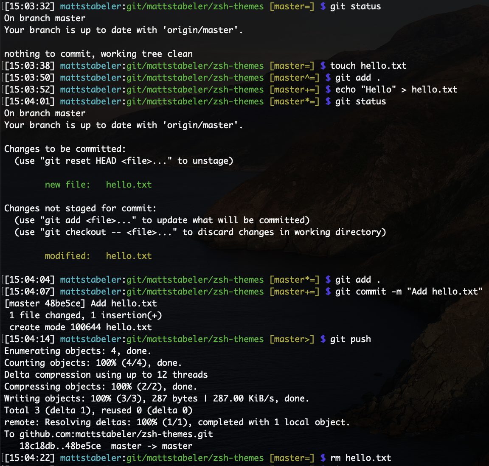

# ZSH Themes

`mattstabeler` is derived from `geoffgarside` and `afowler` themes, but adds more git status flags. 

# Installation

Alias to the `custom` directory in oh my zsh. 

`ln -s mattstabeler.zsh-theme ~/.oh-my-zsh/custom/themes/mattstabeler.zsh-theme`
